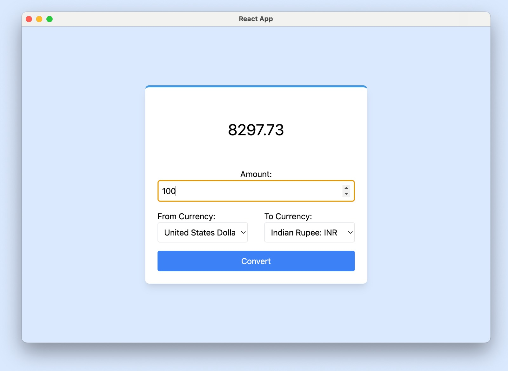
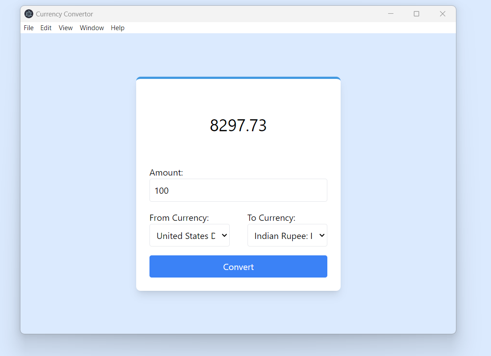

# Currency Converter App

The Currency Converter App is a desktop application built with Electron.js and React that enables users to convert currencies using real-time exchange rates provided by the Exchange Rate API.

## Salient Features

- User-friendly interface for currency conversion.
- Real-time exchange rate data fetched from the Exchange Rate API.
- Support for a wide range of currencies.
- Cross-platform compatibility (Windows, macOS, Linux).

## Technology Stack   

- Electron.js 
- React
- Tailwind CSS
- [Exchange Rate API](https://www.exchangerate-api.com/docs/overview)

## MacOS
  
  
## Windows
  

### Prerequisites

Before you begin, ensure you have met the following requirements:

- [Node.js](https://nodejs.org/) installed on your system.
- [Git](https://git-scm.com/) installed (optional for cloning the repository).

## Installation

Follow these steps to set up and run the Currency Converter project on your local machine:

1. Clone the repository to your local machine:
```bash
git clone https://github.com/mahima-uz/currency_convertor.git
```

2. Change to the project directory:
```bash
cd currency_converter
```

3. Install all required packages for the backend:
```bash
npm install
```

4. Change to the React app directory:
```bash
cd react-app
```

5. Install all required packages for the React app:
bash
npm install


6. Return to the main project directory:
```bash
cd ..
```

7. Start the development server:
```bash
npm run dev
```

## Usage
  1. Add Amount that you want to convert
  2. Choose source currency from `fromCurrency` dropdown and target currency from `toCurrency`
  3. Click on convert

## Limitations

- Under the free version of the API, there are a limited number of requests for API key generated for a signed in user.

## Learnings

During the development of the Currency Converter App, we encountered several challenges:

- It was a new tech stack, it took me some time to get familiar with Electron JS.

- Integeration of React JS and Electron JS was challenging.
  

## Support and Contact

For any questions, feedback, or support related to the Currency Converter App, please don't hesitate to reach out:

- [Mahima Pasricha]
- Email: [pasrichamahima25@gmail.com]
- GitHub: [Your GitHub Profile](https://github.com/mahima-uz)
